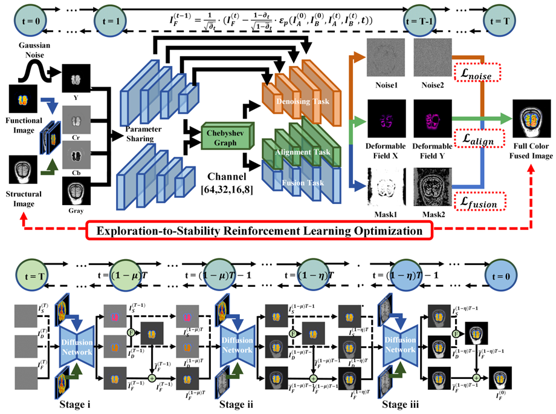
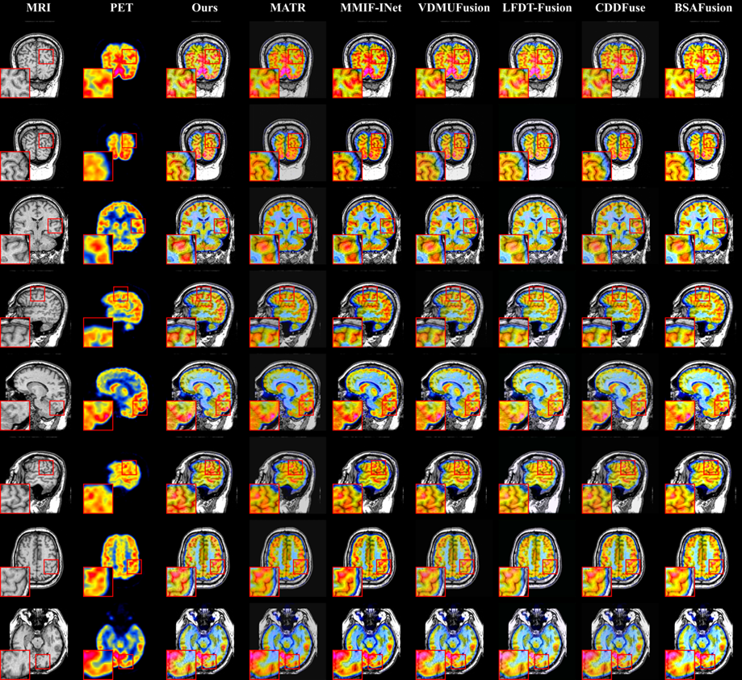
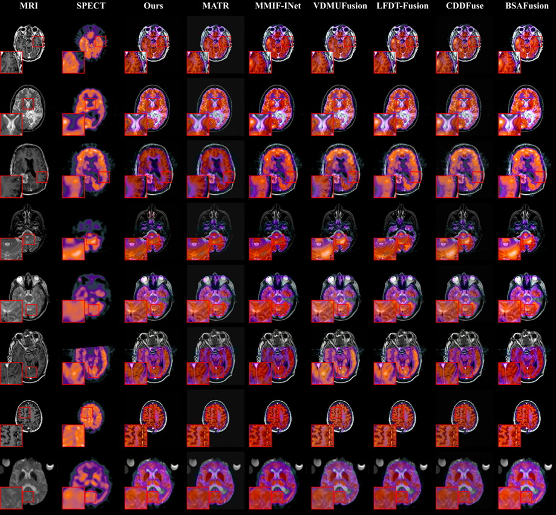
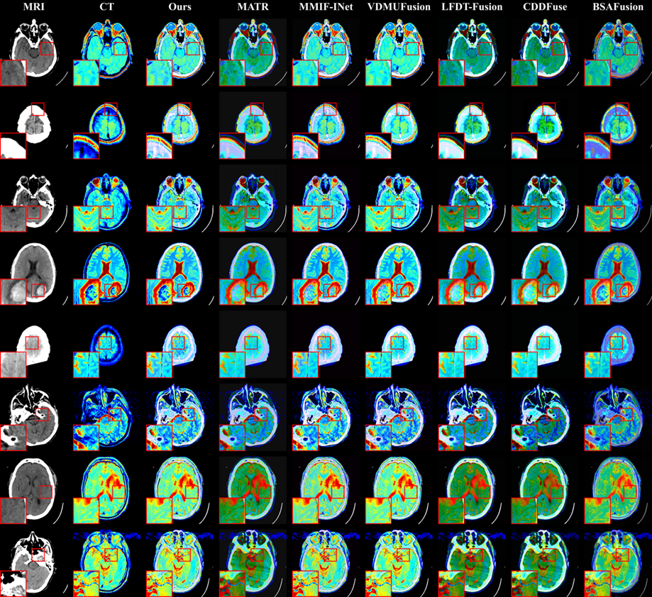
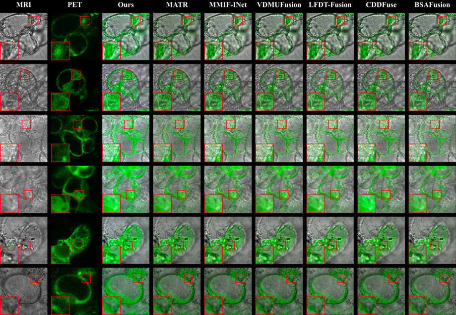
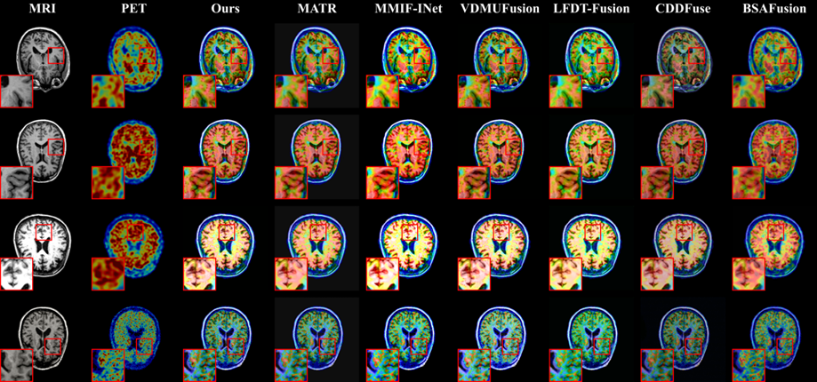

# Diff-FCCF
Please leave us a star ⭐⭐⭐ if you find this work helpful.
<div align="center">

<h2 style="border-bottom: 1px solid lightgray;">🧠✨👀A Novel End-to-End Unsupervised Multi-Task Diffusion Network for Hierarchical Medical Multi-Modality Image Full-Color Channel Fusion</h2>
</div>
<p align="center">
  <a href="#">
  <p align="center">
    <a href='https://arxiv.org/'></a>
    <a href='https://huggingface.co/datasets/DanceSkyCode/Diff-FCCF-Medical-Image-Fusion-Dataset/blob/main/HARVRD-PET-MRI.zip'></a>
    <a href='https://huggingface.co/datasets/DanceSkyCode/Diff-FCCF-Medical-Image-Fusion-Dataset/blob/main/HARVRD-SPECT-MRI.zip'></a>
    <a href='https://huggingface.co/datasets/DanceSkyCode/Diff-FCCF-Medical-Image-Fusion-Dataset/blob/main/HARVRD-CT-MRI.zip'></a>
    <a href='https://huggingface.co/datasets/DanceSkyCode/Diff-FCCF-Medical-Image-Fusion-Dataset/blob/main/GFP.zip'></a>
    <a href='https://huggingface.co/datasets/DanceSkyCode/Diff-FCCF-Medical-Image-Fusion-Dataset/blob/main/ADNI.txt'></a></a>
  </p>
</p>


## 👀Update
- [2025/10] 😊😊😊Release data setting and preprocess for Diff-FCCF.
- [2025/10] 🔥🔥🔥Release all the code for Diff-FCCF.

✨✨✨Model Weight will be released after accepted.


## 📑Abstract
Medical image fusion (MIF) aims to integrate complementary information from multiple imaging modalities into a single, informative image to enhance clinical diagnosis and treatment. While deep learning-based MIF methods have achieved significant progress, they still face critical challenges, including the separate-stage optimization of multi-tasks, limited adaptability in modality information imbalance, and suboptimal training results. Recent diffusion probabilistic models offer promising generative capabilities for image processing; however, existing diffusion-based fusion frameworks remain constrained by the overlook in handling full-color functional data, and fixed inference procedures in simplified grayscale fusion pipelines. To address these challenges, we propose Diff-FCCF, an end-to-end unsupervised multi-task diffusion network for full-color channel fusion in multi-modality medical imaging. Diff-FCCF unifies full-color image fusion, image registration, and denoising tasks within a single framework. A novel Chebyshev graph-guided U-Net is introduced in the diffusion denoising module to enhance cross-modal alignment. Additionally, a hierarchical inference strategy dynamically adjusts the fusion process to mitigate modality dominance and information imbalance. To optimize training without ground truth, we introduce an exploration-to-stability reinforcement learning strategy guided by a multi-objective loss, improving convergence and generalization. Extensive experiments on five benchmark fusion groups demonstrate that Diff-FCCF achieves state-of-the-art performance in both quantitative and qualitative evaluations, especially outperforming comparable methods by more than 20% in the Mutual Information (MI) metric, and producing diagnostically valuable, interpretable fusion results.
### Framework
<div style="text-align: center;">
    
</div>
<p> Overall framework of Diff-FCCF. (a) The training pipeline employs a multi-task U-Net to predict the noise, deformable field, and fusion masks based on a full-color strategy and an exploration-to-stability reinforcement learning optimization. (b) The inference pipeline adopts a Hierarchical Condition Enhancement strategy to predict the noise, deformable field, and fusion masks, and refines foreground details across three progressive stages.</p>


## 🚀Environment

We test the code on PyTorch 2.6.0 + CUDA 12.9.
1. Create a new conda environment
```
conda create -n Diff-FCCF python=3.12.7
conda activate Diff-FCCF
```

2. Install dependencies
```
pip install -r requirements.txt
```


## 🚀Evaluation
You can directly test our model to generate fused images using the following code (note: the pre-training weights sholud be saved in the './check/' file)


```
python evaluation.py
--pet_folder ["/Dataset/Medical/Train/PET-MRI/pet"] \
--mri_folder ["/Dataset/Medical/Train/PET-MRI/mri"] \
--fusion_folder ["/Dataset/Medical/Train/PET-MRI/fusion_output"] \
```


<h2 style="border-bottom: 1px solid lightgray; margin-bottom: 5px;">🐰 Raw Datset and Preprocessed Dataset Download</h2>

| Dataset | Dataset | Dataset |
|---------|---------|---------|
| **Harvard Dataset**<br>[Download](http://www.med.harvard.edu/AANLIB/home.html) | **GFP**<br>[Download](https://data.jic.ac.uk/Gfp/) | **ADNI**<br>[Download](https://adni.loni.usc.edu/) 


The data should organized in the following format:
```
train
├── HARVARD-CT-MRI                                    
│   ├──CT                                      
│   │   ├──0000.png                          
...                                          
│   ├──MRI                                     
│   │   ├──0000.png                            
...                                           
├── HARVARD-PET-MRI                          
│   ├──PET                        
│   │   ├──0000.png                    
...                                  
│   ├──MRI                             
│   │   ├──0000.png                        
...                                         
├── HARVARD-SPECT-MRI                              
│   ├──SPECT                              
│   │   ├──0000.png                      
...                                          
│   ├──MRI                            
│   │   ├──0000.png                       
...                      
├── GFP                                   
│   ├──g                              
│   │   ├──0000.png                      
...                                          
│   ├──f                            
│   │   ├──0000.png                       
...                                     
├── ADNI                                   
│   ├──PET                              
│   │   ├──0000.png                      
...                                          
│   ├──MRI                            
│   │   ├──0000.png                       
...                                     
```
### 2. 🚀Start training
You can use the following code to train the LFDT-Fusion model for different fusion tasks.
```
python train.py
--pet_dataset_path ["/Dataset/Medical/Train/PET-MRI"] \
--epoch ["\config.json" --epoch]\
--T ["\config.json" --T]\
--lr ["\config.json" --lr]\
You can find their corresponding configuration file paths in './config.json'.
```

## Fusion examples
### 1. 🖼️Hardvard PET-MRI Fusion
<div style="text-align: center;">
    
</div>
<p>Visual comparison of Diff-FCCF with 6 SOTA methods for MRI and PET image fusion. For a more intuitive comparison, the regions are enlarged as close-ups.</p>

### 2. 🖼️Hardvard SPECT-MRI Fusion
<div style="text-align: center;">
    
</div>
<p> Visual comparison of Diff-FCCF with 6 SOTA methods for MRI and SPECT image fusion. For a more intuitive comparison, the regions are enlarged as close-ups.</p>

### 3. 🖼️Hardvard CT-MRI Fusion
<div style="text-align: center;">
    
</div>
<p> Visual comparison of Diff-FCCF with 6 SOTA methods for MRI and CT image fusion. For a more intuitive comparison, the regions are enlarged as close-ups. CT images are preprocessed with rainbow mapping.</p>

### 4. 🖼️GFP Fusion
<div style="text-align: center;">
    
</div>
<p>Comparison of Diff-FCCF with 6 SOTA methods for PC and GFP image fusion. The intuitive regions are enlarged as close-ups.</p>

### 5. 🖼️ADNI CT-MRI Fusion
<div style="text-align: center;">
    
</div>
<p> Comparison of Diff-FCCF with 6 SOTA methods for MRI and PET image fusion.  The intuitive regions are enlarged as close-ups. PET images are preprocessed with rainbow mapping.</p>

### 6. 🖼️Hierarchical Condition Enhancement in Inference Phase
<div style="text-align: center;">
    
</div>
<p> Three-stage denoising visualization during inference, presented for the fused image and its corresponding Y, Cr, and Cb channels.</p>

# 🏷️ License
This repository is released under the MIT license. See [LICENSE](./LICENSE) for additional details.